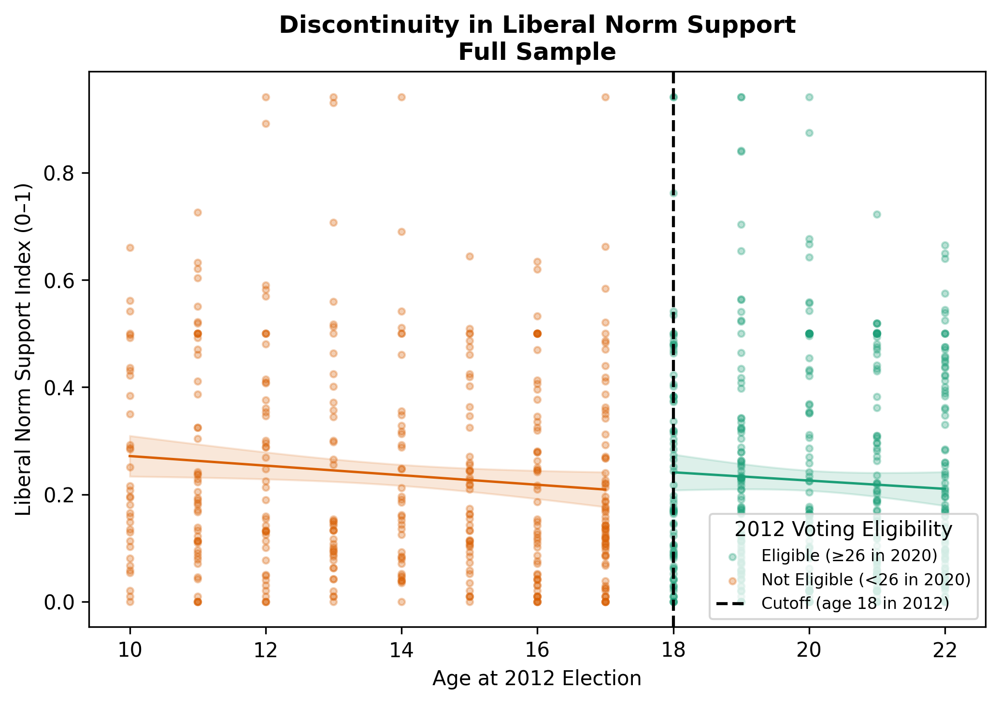
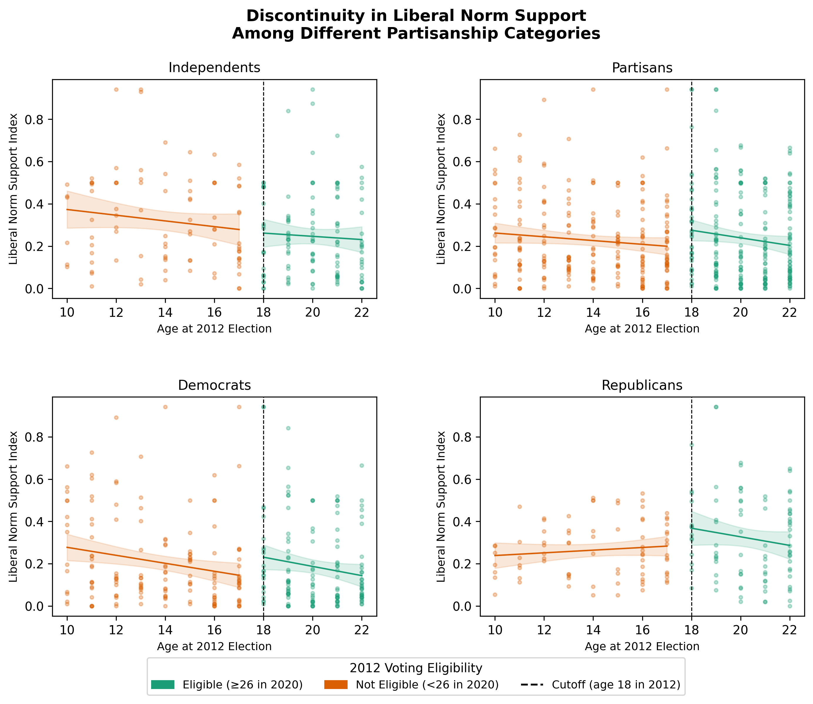
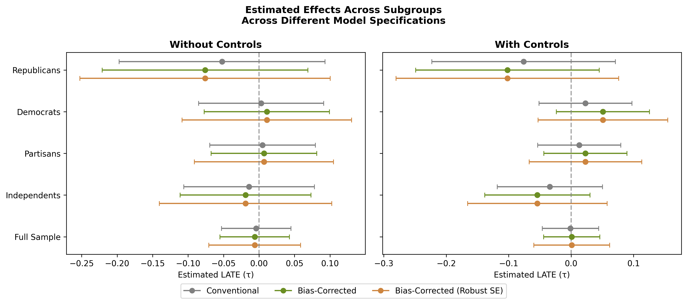
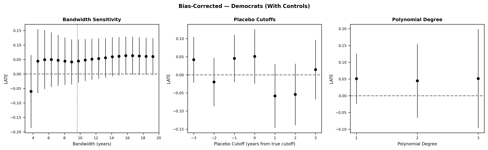
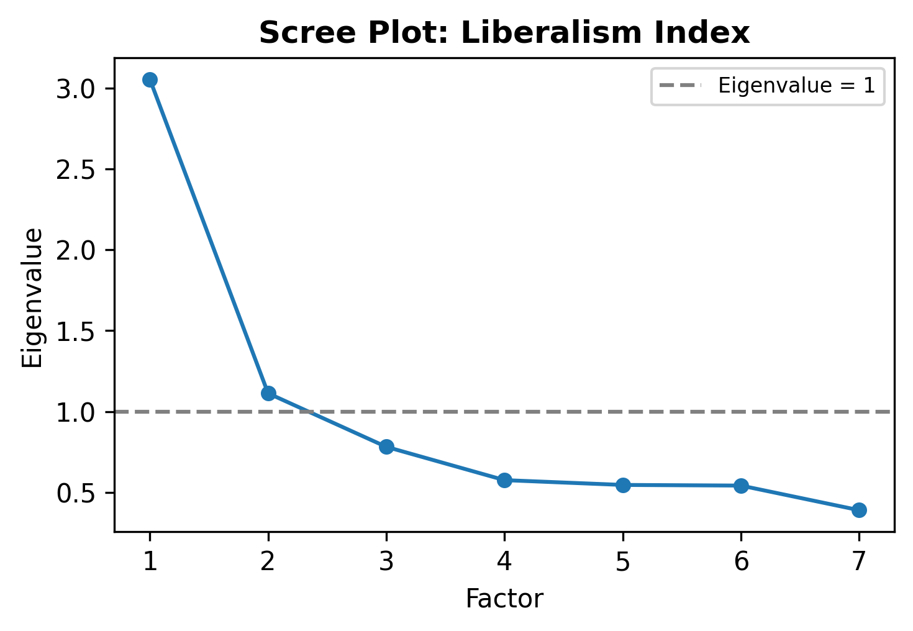
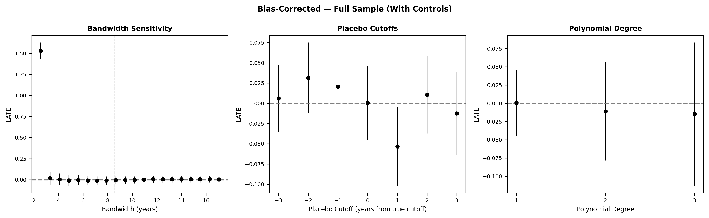
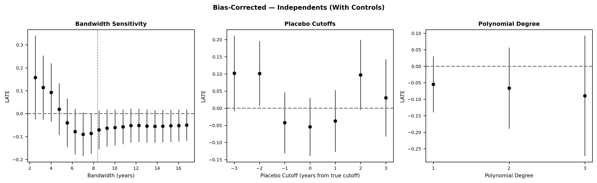
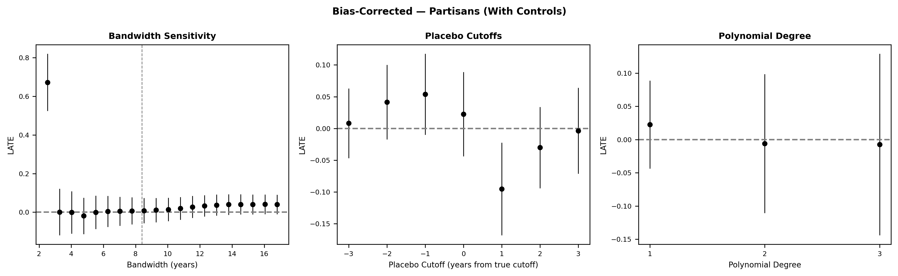
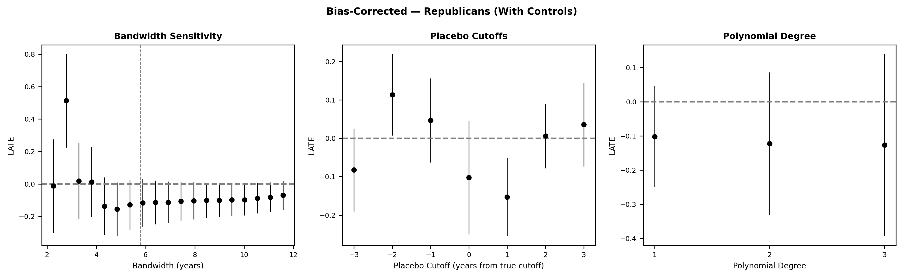

\pagenumbering{gobble}



\thispagestyle{empty}

::: {##toc}
\tableofcontents
:::



\pagenumbering{arabic}

---
bibliography: references.bib
---

```{=latex}
\pagenumbering{arabic}
\setcounter{page}{1}
```

# Introduction

The 2016 U.S. presidential election marked a rupture in American political life. Supporters chanted "Lock her up!" as protesters were forcibly removed from rallies, while journalists, judges, and opponents were routinely framed as enemies of the people [@bekafigo2019]. For many young voters, this was their first political memory as adults; the moment they entered democracy. If early political experiences leave lasting marks, what are the consequences of coming of age in a context where core democratic principles were openly challenged? This gives rise to the following research question

\begin{adjustwidth}{1em}{1em}
\emph{Does entering political life during an election characterized by weaker adherence to liberal democratic norms shape long-term support for these norms?}
\end{adjustwidth}

To address this question, I use a sharp regression discontinuity design (RDD) to leverage the age-based cutoff for voting eligibility in the 2012 U.S. presidential elections. This enables me to isolate the causal effect of entering the electorate during a moment of democratic stability versus democratic rupture.

## 2016 Toxicity and the Trump Effect

The 2016 U.S. presidential election was far from ordinary, marking a rupture, both in tone and behavior, that distinguished it sharply from previous elections. By many accounts, the 2016 race was "one of the most polarizing elections in U.S. history" [@bekafigo2019, 1174]. Trump's candidacy was marked by unprecedented negative campaigning, intra- and inter-party conflict, and rhetoric targeting entire social groups. @cassese2021 [30] documents that "dehumanizing political rhetoric was a common facet of the 2016 presidential contest," contributing to a broader climate of political hostility. @cremer2023 argues that the Republican Party's platform under Trump, combining anti-immigrant nativism, anti-elite populism, and authoritarian rhetoric, closely matches the definition of the populist radical right studied in the European context.

From a legal and institutional standpoint, Trump represented a break from previous presidencies: as early as 2016, he was openly undermining unwritten conventions that helped uphold liberal democracy. He consistently disrespected political norms, merged private gain with public office, ignored transparency norms, and normalized falsehoods [@siegel2018]. His attacks on the media framed news organizations as enemies of the people [@meeks2020], while contempt for judicial independence represented a direct challenge to the liberal component of American democracy. @kaufman2019 argue that Trump's rise bears resemblance to democratic backsliding patterns observed in Venezuela, Hungary, and Turkey, characterized by demonization of the media, racial scapegoating, attacks on judicial independence, and erosion of democratic norms. It is in this environment that a cohort of young voters entered the electorate for the first time.

## Literature Review

This paper draws on three strands of literature to examine how coming of age under a norm-breaking presidency may shape support for liberal democratic principles. The first establishes the conceptual foundations, defining liberal democratic norms and their relationship to democratic backsliding. The second examines public support for democratic norms: why it matters for democratic survival, how it has evolved across time and cohorts, and what explains variation in citizens' willingness to uphold these norms. The third explores early adulthood as a formative period for political socialization, focusing on the long-term effects of first-time electoral experiences.

### (Liberal) Democracy

Existing research highlights a distinction between 'electoral' and 'liberal' democracy [@claassen2025; @coppedge2016; @mounk2018]. Whereas the former is akin to a 'bare-bones' democracy closely mirroring Dahl's "polyarchy" [@dahl1971], the latter refers to a political system that extends beyond free and fair elections, encapsulating "the intrinsic value of protecting individual and minority rights against potential 'tyranny of the majority' and state repression more generally" [@coppedge2016, 582]. This is achieved through a robust rule of law, checks on executive power, and the protection of civil liberties [@claassen2025; @coppedge2016].

@claassen2025 differentiate between two categories of liberal democratic principles. Whereas electoral democracy encompasses only electoral principles (freedom of expression, freedom of association, universal suffrage, elected decision-makers, and free and fair elections) liberal democracy additionally incorporates liberal principles: judicial and legislative constraints on the executive, and equality before the law. Crucially, systems that lack these liberal principles can be understood as forms of "illiberal democracy," a variety that "mixes a substantial degree of democracy with a substantial degree of illiberalism" [@zakaria1997, 24], and which is closely related to populism [@mudde2004; @mudde2007].

### Support for Democratic Norms

Public support for liberal democratic norms constitutes the first of the two main strands of literature I examine. In this section, I discuss (i) the importance of this support for democratic survival, (ii) recent trends, and (iii) the main explanatory factors behind changes in support for liberal democratic norms, particularly elite cues and partisanship.

#### Importance and Recent Trends

Existing work underscores the importance of public support for liberal democratic norms for resilience against backsliding [@claassen2020; @jacob2025; @miller2021; @weingast1997]. @weingast1997's game-theoretic model frames democracy as a self-enforcing equilibrium: sovereigns respect democratic limits only insofar as citizens are willing to defend those limits. This mechanism breaks down when citizens hold inconsistent views about where those limits lie, or when they are unwilling to enforce them. @claassen2020 provides the most comprehensive empirical evidence, finding a robust positive link between public support and the survival of democratic institutions across 135 countries and almost 30 years. @jacob2025 extends this by proposing that anti-pluralist incumbents are more likely to violate democratic norms when public support for democracy is low, as doing so carries lower electoral costs.

Against this backdrop, existing trends in the United States present a mixed but alarming picture. @foa2016 document the "deconsolidation" of democratic support, particularly among younger cohorts: whereas 72% of Americans born before World War II viewed living in a democracy as essential, only 30% of millennials did. @claassen2023 similarly find generational rather than life-cycle declines: younger cohorts are consistently less supportive of democracy, and these lower levels do not appear to increase with age. @wuttke2022 document analogous trends across 18 European countries, where growing shares of respondents, particularly younger cohorts, hold "democrats in name only" positions. Not all accounts point uniformly downward: @treisman2023 cautions against overstating democratic erosion and argues that support has been rising in established Western liberal democracies, while @holliday2024 find that the American public remains overwhelmingly supportive of democratic norms even after divisive elite rhetoric (even though crucially, this support does not translate into willingness to punish norm-violating candidates electorally). Together, these findings paint a mixed picture: even though aggregate levels of democratic support remain high, the behavioral implications of that support are deteriorating, particularly among younger cohorts.

#### Some Explanations

A growing body of research has sought to explain variation in citizens' willingness to support or tolerate democratic norm violations, identifying a range of supply- and demand-side factors.

On the supply side, @grillo2023 shows that a leader can gain popularity by violating democratic norms less severely than expected; a "fear-and-relief" mechanism through which lowered expectations make milder transgressions come as a relative relief. @frederiksen2022a similarly finds that competence and undemocratic behavior operate in parallel: a competent but undemocratic candidate may be preferred over a democratic but incompetent one.

On the demand side, @grossman2022 argue for the existence of "majoritarian" voters; individuals who believe that popular election grants leaders a blank check, including to undermine checks and balances. @bartels2020 find that the strongest predictor of endorsing democratic norm violations among Republicans is ethnic antagonism. @krishnarajan2023 introduces the concept of "rationalizing democracy": citizens resolve the tension between co-partisan advantage and democratic principles by redefining the terms, coming to view desired policies pursued through undemocratic means as democratic and vice cerse. A related body of work identifies misperceptions as a key mediating mechanism: @braley2023 show that willingness to undermine democratic norms is driven partly by the belief that opponents are already willing to subvert democracy first, and that correcting these perceptions made partisans more willing to uphold democratic norms.

#### Polarization

Before turning to the main explanatory trends, I consider the role of affective polarization, the "tendency \[...\] to view opposing partisans negatively and copartisans positively" [@iyengar2015, 691]. Polarization in the United States has increased significantly in recent decades, making its relationship with democratic norm erosion particularly salient [@boxell2024; @iyengar2019; @phillips2022]. However, this relationship remains "far from straightforward" [@druckman2023, 150].

Theoretically, as polarization increases hostility between partisan groups, voters may become more willing to accept anti-democratic measures directed at the out-group. @orhan2022 provides observational support across 53 countries and 170 elections, finding that affective polarization is positively correlated with democratic backsliding. @kingzette2021 similarly show that affective polarization leads to lower public support for democratic norms through "norm politicization": under high polarization, partisans will opportunistically oppose or support liberal protections depending on whether their party holds power. However, empirical evidence remains inconclusive: @broockman2023 and @voelkel2023 find that experimentally reducing affective polarization does not translate into increased support for democratic norms, and @druckman2023 conclude that affective polarization does not appear to be a necessary condition for democratic backsliding.

These mixed findings motivate the turn to the two explanatory frameworks that have accumulated stronger empirical support: elite cues and partisan dynamics.

#### Elite Cues and Partisanship: The Main Trends

Existing literature converges on two interconnected explanations for why citizens fail to consistently uphold democratic norms: the influence of elite cues, which shape what citizens perceive as acceptable, and the dynamics of partisanship, which determine how those cues are received.

##### **Elite Cues**

Voters rely extensively on cues from political figures to navigate their political environment [@archer2023; @brader2012; @dickson2025]. @bakker2020 show that this reliance on partisan cues reflects the "expressive utility" of following one's party: cue receptivity is highest among citizens with strong partisan social identification. These mechanisms have direct implications for democratic norm erosion. @druckman2024 places elites at the center of backsliding dynamics: they are uniquely positioned to violate laws and norms, and citizens function as latent legitimators whose tolerance for undemocratic actions encourages further transgression. The empirical evidence is substantial: @clayton2021 show that exposure to Trump's attacks on the legitimacy of the 2020 election eroded electoral confidence among his supporters; @arceneaux2023 document that belief in the "big lie" was pervasive and sticky among Republicans; and @fossati2022 demonstrate that Indonesians are more willing to embrace illiberal practices when endorsed by in-party elites.

##### **Partisanship**

Partisanship operates in tandem with elite cues. @graham2020 find that most American voters prioritize partisan considerations over democratic principles when the two conflict: "partisans first and democrats only second" [@graham2020, 393]. Similarly, @simonovits2022 document widespread "democratic hypocrisy": citizens systematically apply different standards to democratic norms depending on whether their party holds power. @svolik2020 illustrates how partisanship can undermine citizens' capacity to function as a democratic check: when punishing norm-violating candidates requires voting against one's party, most voters opt for partisan loyalty over democratic principle.

Taken together, the interaction of elite signaling and partisan identity creates conditions under which even abstractly pro-democratic citizens may come to tolerate or endorse norm violations, particularly when exposed to a political context characterized by sustained elite questioning of democratic principles. Whether first exposure to such a context during a politically formative stage of adulthood produces durable effects on democratic commitments is the central empirical question of this paper.

### Coming of Age

The final strand of literature examines the role of early adulthood as a moment of political socialization. Existing research suggests that first electoral experiences during early adulthood play a formative role in shaping long-term political behavior.

#### Childhood and Early Adulthood as Formative Periods for Long-Term Behavior

Existing research has underscored the enduring impact of childhood and early adulthood on later-life outcomes. @shonkoff2012 detail how toxic stress in early childhood leads to long-term impairments in learning, emotional regulation, and health. Similarly, @bellucci2020 show that individuals exposed to warfare during childhood exhibit lower financial risk-taking in adulthood, and @kesternich2020 find that childhood hunger in postwar Germany is associated with significantly lower interpersonal trust later in life.

While childhood sets important trajectories, early adulthood provides a second period of heightened malleability. @arnett2000 conceptualizes this period of "emerging adulthood" as uniquely open-ended: between ages 18 and 25, individuals explore work, education, relationships, and lifestyle choices with relative freedom from institutional and familial constraint, making this an intense phase of self-construction. @luecken2010 argue that early adulthood marks a second point of vulnerability and openness to external influence, in which childhood dispositions can be reinforced, redirected, or disrupted. This developmental plasticity means that external shocks or exposures during this period may have durable effects on future behavior.

#### Early Adulthood and Future Political Behavior

One of the domains in which the long-term impact of early adulthood is most evident is political behavior. @mannheim1928 introduces the concept of 'fresh contact,' arguing that initial encounters with political authority and conflict crystallize lasting political worldviews. Recent empirical work supports this: @neundorf2013 show that political interest develops most dynamically during adolescence and early adulthood, stabilizing around age 25, while @dinas2013 finds that young adults adjust their political evaluations more flexibly than older cohorts.

@ghitza2023 find that political preferences are largely shaped by events encountered between ages 14 and 24, and that cohort-defining moments like the Kennedy, Reagan, or Trump years create stable partisan divides. @sears1997 [47] find that exposure to presidential campaigns can shape attitudes even before eligibility to vote, and argue that generational cohorts "polarize internally around the symbolic events of its day," a finding that is directly relevant to understanding the 2016 election as a cohort-defining moment.

Longitudinal data confirm that political orientations established in this period often endure. @jennings2014, drawing on decades of panel data, find that attitudes formed in early adulthood tend to persist across the life course, while @sears1999 similarly show that party identification and ideological orientations exhibit striking stability over nearly four decades.

#### First-Time Voting and Habit Formation

One of the clearest applications of the formative nature of early adulthood lies in first-time voting. @plutzer2002's developmental theory of turnout conceptualizes young adulthood as a period in which individuals either transition into habitual voting or remain habitual nonvoters, with initial experiences proving especially consequential. @dinas2012 finds that voting in a first election increases the likelihood of voting in subsequent elections, even decades later. @meredith2009, using age-based discontinuities, shows that eligibility at a presidential election increases turnout in subsequent elections and affects partisan identification, with effects persisting across cycles. This study extends the logic of first-election effects beyond turnout and into attitudes toward democratic norms. While prior research shows that early voting can entrench civic habits, it remains unclear whether the nature of the political context, particularly in moments of institutional erosion, shapes how young people internalize liberal democratic attitudes.

Taken together, this literature positions early adulthood as a formative and fragile window, where social contexts and political experience leave lasting marks on civic behavior. This paper contributes to this literature by examining whether coming of age during a period marked by democratic norm erosion shapes long-term attitudes toward liberal democratic principles.

### Conclusion

Existing research underscores the developmental importance of early adulthood, the long-term effects of first-time voting, and the role of elite signaling and partisan dynamics in shaping democratic attitudes. It also documents both the importance of public support for democratic survival and the conditions under which that support erodes. While these strands are often studied separately, they intersect in moments of political rupture. This paper builds on their insights by asking whether coming of age during a period marked by democratic norm violations produced lasting effects on democratic commitments. By connecting theories of political socialization with empirical findings on the drivers of support for liberal democratic norms, it contributes to understanding how democratic backsliding may be reproduced across generations through the socialization of new voters.



# Theory

Building on these insights, this section introduces the paper's theoretical framework. It outlines how early political socialization, partisan sensitivity, and the ideologically asymmetric effects of political context shape long-term liberal attitudes.

## H1: First Encounters with Democracy in a Moment of Rupture

Early adulthood is politically formative: experiences during this period leave long-lasting marks on political behavior. This paper applies that logic to the 2016 presidential election. For many voters born around the turn of the millennium, their first experience of democracy as political adults was voting in 2016, a context where long-standing norms around pluralism and institutional respect were openly put into question by political elites like Donald Trump [@sides2018; @siegel2018].

If this context is norm-eroding rather than norm-affirming, the process of political learning becomes distorted at the moment it is most sticky [@franklin2004; @dinas2012]. First-time voters in 2016 were thus especially vulnerable, not only because they were politically young, but because the institutional cues they received were normatively degraded. This leads to the central hypothesis:

*H1: Being a first-time voter in the 2016 election will have a negative effect on long-term liberal attitudes ('first-time sensitivity' hypothesis)*

## H2: Partisan Sensitivity to Political Context

A growing body of research suggests that partisanship shapes how individuals interpret and respond to their political environment. @mandel2014 find that partisans report higher life satisfaction under favorable political conditions and lower satisfaction under unfavorable ones, while independents express intermediate levels, suggesting that partisans are more emotionally attuned to political developments. Independents also vote at significantly lower rates than partisans [@magleby2011] and are less influenced by partisan cues [@brader2012; @banda2021; @fuller2025], suggesting lower overall political engagement and a weaker tendency to internalize affective frames from polarized political contexts.

As a result, independents may have been less susceptible to the norm-violating cues of the 2016 Trump campaign, while partisans may have absorbed these cues more readily. This 'sensitivity asymmetry' leads to the expectation that the long-term impact of coming of age in 2016 will be more pronounced among partisans than among independents:

*H2: The negative effect of being a first-time voter in the 2016 election will be stronger among partisans (Republicans or Democrats) than among independents ('non-partisan insensitivity' hypothesis)*

## H3: Asymmetric Sensitivity and Partisan Differences

The third hypothesis builds on the "asymmetric sensitivity" hypothesis proposed by @mandel2014, which posits that Republicans are more psychologically and affectively responsive to their political environment than Democrats. This pattern is consistent with research showing that conservatives are more likely to be impacted by affectively charged or threatening information [@carraro2011; @dodd2012; @oxley2008], anticipate and experience stronger emotional reactions to negative outcomes [@joel2014], and are more easily disgusted [@inbar2009; @smith2011]. @graham2012 further argue that conservatives process political information with greater attentiveness to both ingroup and outgroup cues.

In the context of 2016, this implies that Republican first-time voters may have been more deeply affected by the politicized context, and more likely to internalize norm-violating cues as acceptable, particularly if doing so aligned with partisan goals. This interpretation is supported by @gidengil2022: in a conjoint experiment, they show that Republicans were more likely to support hypothetical in-party candidates favoring executive aggrandizement when they echoed cues from President Trump. Crucially, the norm-eroding elite cues came primarily from the Republican side [@cassese2021; @siegel2018], further amplifying the expected asymmetry:

*H3: Within partisans, the negative effect of being a first-time voter in the 2016 election will be stronger among Republicans than among Democrats ('asymmetric sensitivity' hypothesis)*

# Research Design

This study uses a sharp RDD to identify the long-term causal impact of being first eligible to vote during a 'conventional' versus 'unconventional' political environment on citizens' liberal attitudes. The core idea is that young people who were just old enough to vote in the 2012 U.S. presidential election experienced a fundamentally different initial political environment than those who were just too young and first voted in 2016. This design translates into a cutoff at age 26 in 2020 (the year of the survey): respondents aged 26 or older were just old enough to vote in 2012, while those under 26 were not. Within a narrow bandwidth around this threshold, the treatment (first voting in 2016 rather than 2012) is as-good-as-randomly assigned by birth timing.

The RDD is estimated using the following specification:

$$
Y_i = \alpha + \tau D_i + f(X_i) + \varepsilon_i
$$

Where:

-   $Y_i$ is the outcome, a continuous index measuring liberal attitudes.
-   $D_i$ is an indicator equal to 1 if respondent $i$ was ineligible to vote in 2012 (i.e., under 26 in 2020; first voted in 2016), and 0 otherwise.[^1]
-   $\tau$ is the parameter of interest, capturing the local average treatment effect (LATE) of first voting in 2016 rather than 2012. A negative $\tau$ is consistent with the first-time sensitivity hypothesis (H1).
-   $X_i$ is the running variable, defined as `years_from_cutoff` $= 26 - \text{age}$, normalised so that the cutoff falls at $c = 0$. Positive values correspond to respondents younger than 26 (ineligible in 2012; treatment = 1); negative values correspond to respondents aged 26 or older (eligible in 2012; treatment = 0).
-   $f(X_i)$ denotes a flexible function (e.g., first- or second-order polynomial) of the running variable estimated separately on each side of the cutoff.
-   $\varepsilon_i$ is an error term.

[^1]: Only bias-corrected estimates are presented in the main text. The conventional and bias-corrected with robust standard errors estimates are shown in the robustness section and discussed further in the Appendix.

## Data

The analysis draws on the 2020 American National Election Studies (ANES) cross-sectional survey, which provides a large, nationally representative sample with a broad set of items on democratic attitudes.[^2]

[^2]: The full set of items is presented in the appendix.

## Liberal Democracy Index

To capture individual-level support for liberal principles, I constructed a composite index from seven items in the 2020 ANES: support for a free press, belief in the importance of checks and balances, endorsement of the rule of law, the belief that citizens must agree on facts to sustain democracy, resistance to unitary executive power, concern over the freedom of the media, and the principle that journalists should have access to government officials. I assessed the items' internal consistency (Cronbach's α = 0.78), confirming that they capture a coherent underlying construct, before z-score standardizing each item. I then used principal axis factor analysis to extract a single latent factor, and rescaled the resulting scores to a 0–1 range, producing a continuous liberalism index where higher values indicate stronger normative commitment to liberal democratic norms.[^3]

[^3]: For further details on index construction, refer to the Appendix.

## Analysis

I estimated a series of sharp RD models using local polynomial regression, implemented via `rdrobust` in Python. Each model uses local linear estimation (polynomial order = 1) and MSE-optimal bandwidth selection, with the running variable `years_from_cutoff` centered at $c = 0$. The preferred estimate throughout is the bias-corrected specification (with conventional rather than robust standard errors.) Models are run separately for each subgroup to test the three hypotheses:

-   **Entire sample (H1):** To test the *first-time sensitivity* hypothesis, I estimated the RD on the full 2020 sample.
-   **Partisans vs. Independents (H2):** To test the *non-partisan insensitivity* hypothesis, I split the sample into partisans (self-identified Democrats and Republicans, with leaners coded to their respective parties) and independents.
-   **Republicans vs. Democrats (H3):** To test the *asymmetric sensitivity* hypothesis, I ran separate models for Republicans and Democrats.

For the full sample and each of the four subgroups, I estimated two specifications: one without covariates, and one including education, income, and race (as dummy variables, with White as the omitted baseline) as controls, selected on the basis of covariate balance tests indicating significant imbalance across the treatment and control groups.[^4]

[^4]: The ovariate balance tests were simple t-tests that looked at imbalances between the treatment and control groups. Items that showed substantial (albeit not necessarily statistically significant) differences between the two groups (p \< 0.25) were categorized as imbalanced and added as controls to the model. I had initially included gender as a covariate; however, as it was relatively balanced between the treatment and control groups, I decided to exclude it.

To assess the robustness of the main estimates, I conducted three sets of sensitivity checks, reported in full in the Appendix: bandwidth sensitivity (re-estimating models across a range of bandwidths from 30% to 200% of the MSE-optimal value), placebo cutoffs (re-running the RDD at $\pm 1$, $\pm 2$, and $\pm 3$ years from the true cutoff), and polynomial degree sensitivity (re-estimating with first-, second-, and third-order polynomials). All robustness checks are run with and without controls.

# Results

This section presents the findings of the paper. I begin by visualizing the discontinuity near the age-at-2012 threshold for the full sample and the partisan subgroups, then present the RD estimates organized by hypothesis, and finally assess their robustness.[^5]

[^5]: Only bias-corrected estimates are presented in the main text. The conventional and bias-corrected with robust standard errors estimates are shown in the robustness section and discussed further in the Appendix.

## Regression Discontinuities

@fig-disfull plots the liberalism index against respondents' approximate age at the time of the 2012 election (`age_in_2012 = age − 8`), with the dashed vertical line marking the cutoff at age 18. Points to the right of the cutoff were old enough to have voted in 2012 (control group); points to the left were not yet 18 in 2012 and first voted in 2016 (treatment group). A negative $\tau$ would therefore indicate that 2016 first-time voters score lower on the liberalism index than their 2012 counterparts, consistent with H1.

{#fig-disfull width="9cm"}

There is no visually apparent discontinuity at the threshold for the full sample. Even though there is a minor jump suggesting lower levels of uspport among the post-Trump cohort, the confidence intervals on both sides of the cutoff overlap substantially. @fig-dissubset breaks this down by partisanship subgroup.

{#fig-dissubset fig-align="center"}

Even though the same pattern holds when examining independents,there is a more notable jump when examining the three other subgroups that, again, suggests lower levels of support among the post-Trump cohort. Nevertheless, in all panels, the confidence intervals on both sides of the cutoff overlap substantially.

## RD Results

@fig-coefplot presents the estimated treatment effects ($\tau$) from the bias-corrected local linear RD models, with and without controls, for each sample. All estimates are expressed on a 0–1 scale.

{#fig-coefplot fig-align="center" width="12cm"}

### H1: First-Time Sensitivity

For the full sample, the estimated discontinuity is small and statistically insignificant in both the uncontrolled and controlled models. There is no detectable causal effect of first-time voting eligibility timing on liberal attitude scores at the threshold. The data therefore provide no support for H1: coming of age during the 2016 Trump election does not appear to produce measurably weaker liberal commitments relative to those who first voted in 2012.

### H2: Non-Partisan Insensitivity

Among independents, $\tau$ is small and statistically insignificant, consistent with the expectation of H2 that politically unaffiliated individuals would be less sensitive to the political context of their democratic initiation. However, aong partisans, the estimate is likewise insignificant, offering no evidence that partisan identifiers were more affected by first-vote timing than the full sample. H2 therefore finds no empirical support in these data.

### H3: Asymmetric Sensitivity

Separating partisans by party, the estimates for both Democrats and Republicans are statistically insignificant across both specifications. No asymmetric effect is detectable: Republican first-time voters do not differ meaningfully from their slightly older counterparts in their liberal attitude scores, nor do Democrats. H3 is not supported.

## Robustness Checks

Given that the main estimates are null across all subgroups, the robustness checks serve primarily to confirm stability rather than to qualify significant findings. @fig-coefplotrobust presents the three estimate types side by side. The null result is consistent across all three estimate types for every subgroup, with and without controls.

{#fig-coefplotrobust fig-align="center"}

@fig-robustness presents the bandwidth sensitivity, placebo cutoff, and polynomial degree checks for the full Democrat subgroup, as an illustrative case.[^6]

[^6]: Robustness checks for the remaining subgroups are presented in the Appendix.

{#fig-robustness fig-align="center"}

Estimates remain consistently null across a wide range of bandwidths. Placebo cutoffs at $\pm 1$, $\pm 2$, and $\pm 3$ years from the true threshold similarly yield insignificant results, suggesting that the null finding at the true cutoff is not an artifact of the specific threshold chosen. Results are also stable across polynomial degrees. Taken together, the robustness checks reinforce the conclusion that there is no detectable effect of first-vote timing on liberal democratic attitudes in this sample.

# Conclusion

This paper set out to ask whether coming of age during the 2016 Trump election produced measurably weaker liberal democratic commitments. Using a sharp RDD that compares those just eligible to vote in 2012 to those who first voted in 2016, I find no statistically significant discontinuity in liberal attitudes, neither in the full sample nor across any partisan subgroup. These null results are stable across alternative bandwidths, placebo cutoffs, and polynomial specifications. Taken together, they suggest that political socialization during a period of elite norm violation does not automatically translate into weaker liberal commitments among those just entering the electorate.

These findings are notable in their own right. One possible interpretation is that liberal democratic norms are more durable and resistant to short-term contextual shocks than theories of impressionable-years socialization might imply. Another is that the mechanism connecting first-time voting context to democratic attitudes is more complex, conditional, or delayed than the simple exposure hypothesis tested here captures, perhaps requiring sustained exposure over multiple electoral cycles rather than a single formative election.

Several avenues for future research follow directly from these limitations. First, the present design relies on age measured in years in the 2020 ANES, which introduces a non-trivial measurement margin around the true eligibility cutoff. Future work using exact birth dates (available in restricted-access versions of the ANES) would sharpen the discontinuity considerably, potentially uncovering effects that are obscured by the coarseness of the current running variable. Second, the sample of first-time 2016 voters in the 2020 ANES is small relative to the full sample, limiting statistical power. Replication using the 2024 ANES, or pooling across multiple survey waves, could improve precision while also enabling an examination of whether the effects might change due to exposure to the polarized contexts of the 2020 and 2024 presidential elections.Third, future research could examine whether the null results are specific to the liberal norms dimension, or whether they extend to electoral norms and attitudes toward democratic institutions more broadly.

Finally, the interaction between political socialization and partisan power status deserves closer attention: research on democratic hypocrisy suggests that citizens apply different standards to democratic norms depending on whether their party holds power [@simonovits2022; @graham2020]. Young voters who came of age in 2016 experienced a Republican win whereas those who first voted in 2020 experienced a contested Democratic win. Whether the socialization effect differs depending on which party is in power at the moment of political initiation, and how this interacts with the respondent's own partisan identity, is a theoretically rich question that warrants further study.





# **Bibliography** {.unnumbered}

::: {#refs}
:::



# Appendix

## Supplementary Materials

Additional supplementary materials, including the full replication code, can be found in the paper's dedicated online repository: <https://github.com/nikolaosvichos/Python-Final-Project>

## Index Construction

This appendix documents the construction of the Liberalism Index, including item wording, internal consistency, factor structure, and rescaling. The index is based on seven items measuring support for liberal democratic norms.

### Item Wordings

The table below provides the exact question wording for each of the seven items included in the index.

```{r, echo=FALSE, warning=FALSE, message=FALSE}
library(kableExtra)

items_table <- data.frame(
  Item = c(
    "Free Press",
    "Checks and Balances",
    "Rule of Law",
    "Agree on Facts",
    "Unitary Executive",
    "Journalist Access",
    "Media Undermined Concern"
  ),
  `Survey Question` = c(
    "How important is it that news organizations are free to criticize political leaders?",
    "How important is it that the executive, legislative, and judicial branches of government keep one another from having too much power?",
    "How important is it that elected officials face serious consequences if they engage in misconduct?",
    "How important is it that people agree on basic facts even if they disagree politically?",
    "Would it be helpful, harmful, or neither helpful nor harmful if U.S.presidents could work on the country’s problems without paying attention to what Congress and the courts say? How helpful/harmful?",
    "Do you favor, oppose, or neither favor nor oppose elected officials restricting journalists' access to information about government decision-making?",
    "How concerned are you that some people in the government today might want to undermine the news media's ability to serve as a check on governmental power?"
  ),
  check.names = FALSE
)

kable(items_table,
      format = "latex",
      booktabs = TRUE,
      caption = "Liberal Items and Survey Wording") %>%
  kable_styling(latex_options = c("HOLD_position", "scale_down")) %>%
  column_spec(1, width = "3cm") %>%
  column_spec(2, width = "10cm")
```

### Internal Consistency

To evaluate the internal reliability of the seven survey items, I computed Cronbach's alpha. The raw alpha is 0.741 and the standardized alpha is 0.782, indicating acceptable internal consistency. The table below reports the factor loadings, communalities, uniquenesses, and item-total correlations for each item from the principal axis factor solution.

```{r, echo=FALSE, warning=FALSE, message=FALSE}
fa_table <- data.frame(
  Item = c(
    "Free Press", "Checks and Balances", "Rule of Law",
    "Agree on Facts", "Unitary Executive", "Journalist Access",
    "Media Undermined Concern"
  ),
  Loading      = c(-0.722, -0.749, -0.694, -0.643, -0.541, -0.608, -0.643),
  Communality  = c( 0.522,  0.561,  0.482,  0.414,  0.293,  0.369,  0.413),
  Uniqueness   = c( 0.478,  0.439,  0.518,  0.586,  0.707,  0.631,  0.587),
  `Item-Total r` = c(0.579, 0.541, 0.475, 0.423, 0.412, 0.496, 0.509),
  check.names = FALSE
)

kable(fa_table,
      format = "latex",
      booktabs = TRUE,
      digits = 3,
      caption = "Factor Diagnostics for the Liberalism Index") %>%
  kable_styling(latex_options = c("HOLD_position"))
```

### Factor Structure

I used principal axis factoring (no rotation) to assess whether the seven items capture a single underlying construct. The table below reports the eigenvalues, variance explained, and cumulative variance for each factor.

```{r, echo=FALSE, warning=FALSE, message=FALSE}
eigen_table <- data.frame(
  Factor = 1:7,
  Eigenvalue = c(3.054, 1.112, 0.781, 0.575, 0.546, 0.542, 0.389),
  `Variance Explained` = c("43.6%", "15.9%", "11.2%", "8.2%", "7.8%", "7.7%", "5.6%"),
  `Cumulative Variance` = c("43.6%", "59.5%", "70.7%", "78.9%", "86.7%", "94.4%", "100.0%"),
  check.names = FALSE
)

kable(eigen_table,
      format = "latex",
      booktabs = TRUE,
      caption = "Eigenvalues from Principal Axis Factoring") %>%
  kable_styling(latex_options = c("HOLD_position"))
```

Based on the Kaiser criterion (eigenvalue \> 1) and the scree plot below, a single factor was retained. The first factor accounts for 43.6% of the total variance; the second factor's eigenvalue of 1.112 falls just above the Kaiser threshold but is substantially smaller than the first, and the scree plot shows a clear elbow after the first factor. All factor loadings are negative and range from −0.541 to −0.749, confirming that the items load coherently on a single liberal democratic norms dimension (higher scores = stronger liberal norm support after sign reversal at the rescaling stage).

{fig-align="center" width="8cm"}

### Index Rescaling

Factor scores on the first factor were extracted and rescaled to the unit interval \[0, 1\] using min–max normalization. Higher values indicate stronger endorsement of liberal democratic norms. This transformation does not affect the relative positioning of respondents on the latent trait. The resulting index has a mean of 0.205 and a standard deviation of 0.169, with a range from 0 to 1 across 5,324 non-missing respondents.

## RD Results

The coefficient plot below presents all three estimate types (conventional, bias-corrected, and bias-corrected with robust standard errors) side by side for each subgroup and model specification.

{fig-align="center" width="17cm"}



## Robustness Checks

The following figures present the full set of robustness checks (bandwidth sensitivity, placebo cutoffs, and polynomial degree) for each subgroup. All plots show bias-corrected estimates with controls. With the exception of some odd 'jumps' in statistical significance in very low bandwidths, and under some placebo cutoffs, the robustness checks confirm the lack of statistical significance of the previous findings.

### Full Sample

{fig-align="center"}

### Independents

{fig-align="center"}

### Partisans

{fig-align="center"}

### Democrats

{fig-align="center"}

### Republicans

{fig-align="center"}
